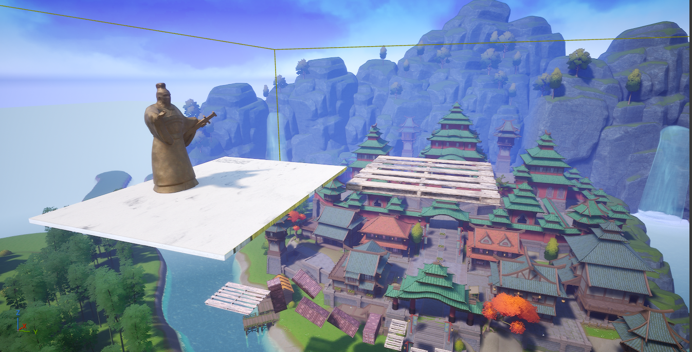

# 目的
・アセットを使って簡単なジャンプアクションゲームを作る

# 使用技術など
・足場の移動
・アセットの実装
・メモリ負荷処理
・完成物のインポート　など

# 実際のゲーム画面
ゲームの背景はこんな感じ
  

無事にオブジェクトの配置や各種の設定が実装できた
素材の統一感がないのは今回はOK（目的は実装や配置とか基本的な操作と調整なので）
  

# 作ってみた感想
・レベルデザインを初めてやってみた
・レベルデザインのモチベはほんとうに自分が作りたいものがあるとめちゃくちゃ楽しいんだろうな～となった
・地味に初見でも気持ちの良いゲーム体験ができるデザインになっているかを検証する作業が大切
・次はこれを応用して溶岩ステージで障害物を飛んでいくステージを制作してみたい

